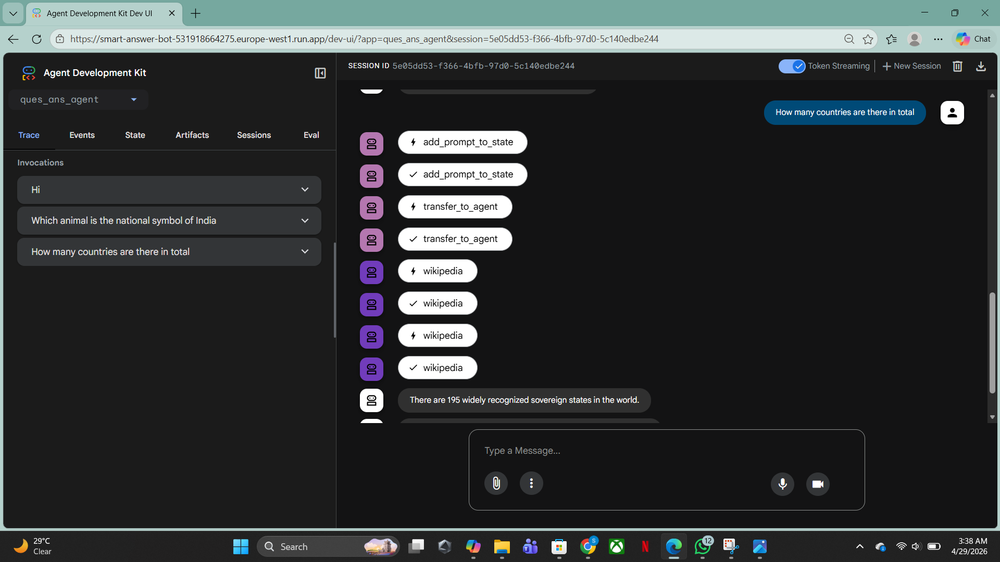

# 🚀 AnswerFlow AI

### *AI-Powered Question Answering Agent for Real-Time Intelligent Responses*

<p align="center">
  
  
  
  
</p>

---

## 🌟 Project Overview

**AnswerFlow AI** is a scalable, AI-powered question-answering system designed to deliver **context-aware, real-time responses**.

It demonstrates a production-style AI pipeline combining **natural language processing**, **modular backend architecture**, and **cloud deployment**.

---

## 🎥 UI Preview

<p align="center">
  
</p>

> 💡 Save your screenshot in your repo as: `assets/ui-preview.png`

---

## 🧠 Key Features

* Context-aware question answering
* Real-time AI response generation
* Modular AI agent pipeline
* Interactive developer UI for testing
* Cloud-native deployment

---

## 🏗️ System Architecture

<p align="center">
  
</p>

**Pipeline Flow:**
User Query → Preprocessing → Intent Understanding → AI Model → Response Engine → UI

---

## ⚙️ Tech Stack

| Layer       | Technology                   |
| ----------- | ---------------------------- |
| 🧠 AI Layer | NLP Models / LLM Integration |
| 💻 Backend  | Python / Node.js             |
| ☁️ Cloud    | Google Cloud Run             |
| 🔗 API      | REST Architecture            |
| 🖥️ UI      | Agent Development Kit Dev UI |

---

## 🚀 Impact & Highlights

* ⚡ Designed a real-time AI response pipeline
* 🧠 Improved answer relevance using structured query handling
* ☁️ Deployed scalable backend on cloud infrastructure
* 🧩 Built modular architecture for extensibility

---

## 🧪 Installation & Setup

```bash
git clone https://github.com/Shanaya31/AnswerFlow-AI.git
cd AnswerFlow-AI
pip install -r requirements.txt
python app.py
```

---

## 📌 Use Cases

* AI Chat Assistants
* Customer Support Automation
* Knowledge Retrieval Systems
* Smart Helpdesk Platforms

---